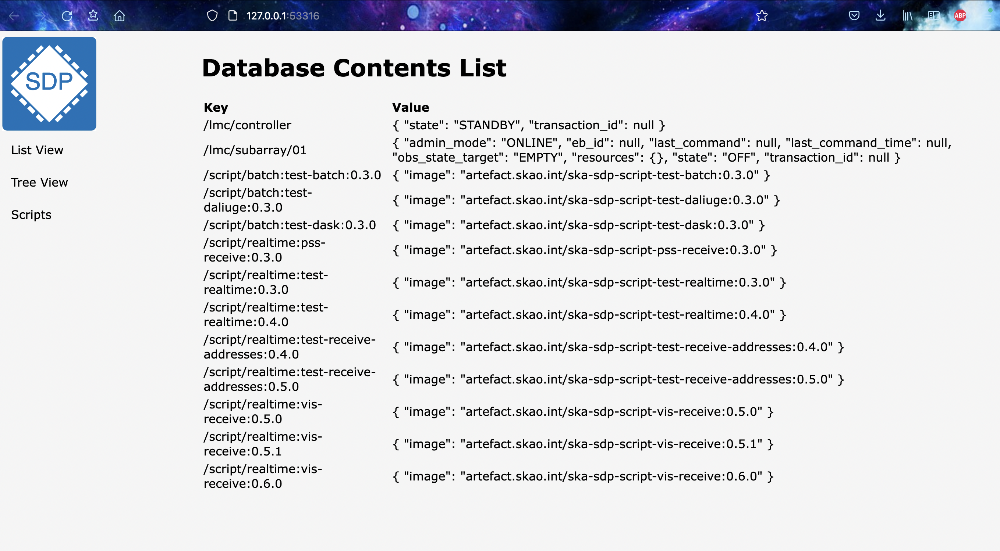

List View
=========

When the user connects to the SDP Operator interface the initial display will be similar to the example below. This consists of a menu and logo
on the left-hand side and a display of the current contents of the `SDP Configuration Database` on the right. This
display corresponds to the `List View` menu item

