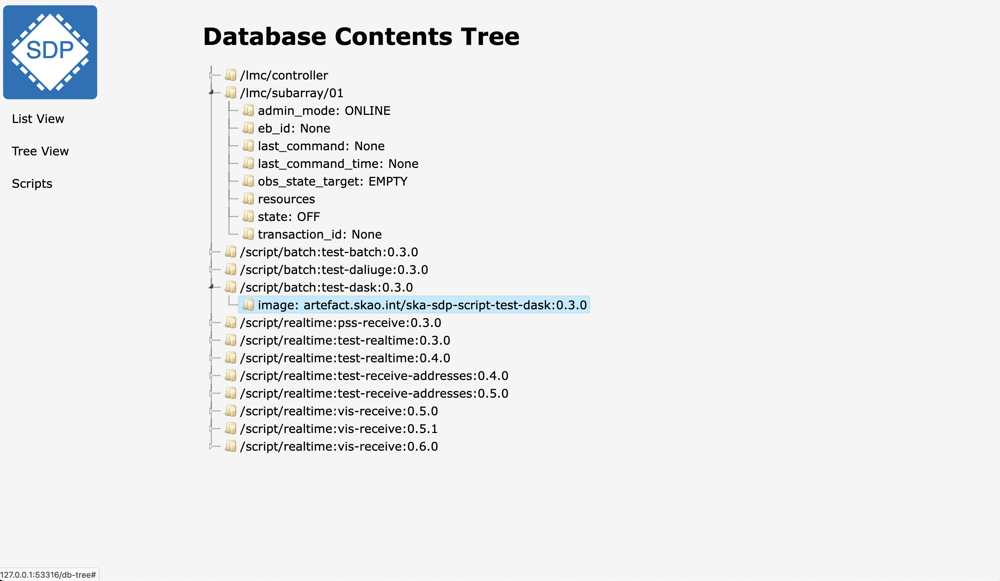

Tree View
=========

Clicking on `Tree View` in the left-hand menu will again show a display of the complete current database
contents - as in `List View` - but this time in a `tree` type format.

This adds new functionality in that clicking on a `tree node` can
be arranged to expand to additional levels
- as is shown in the example below

