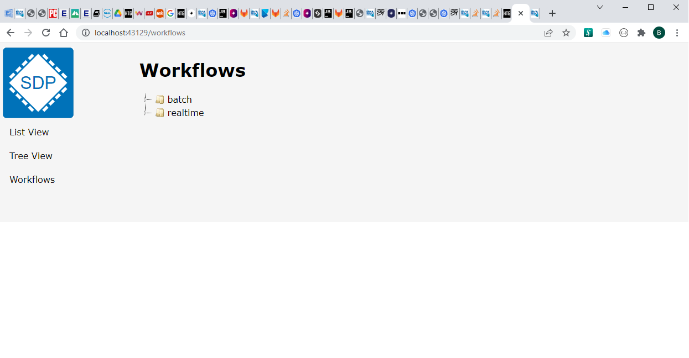
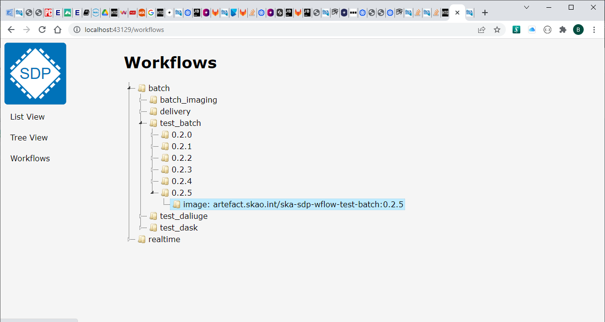

Workflows View
==============

Clicking on `Workflows` in the left-hand menu will initially show a display of the types of `workflows`
(currently just two) defined
in the `Configuration Database` in a `tree` type view.

Clicking on a `tree node` may, if supported, expand the tree further  - and this can be repeated to display more detailed
content - as is shown in the example below

